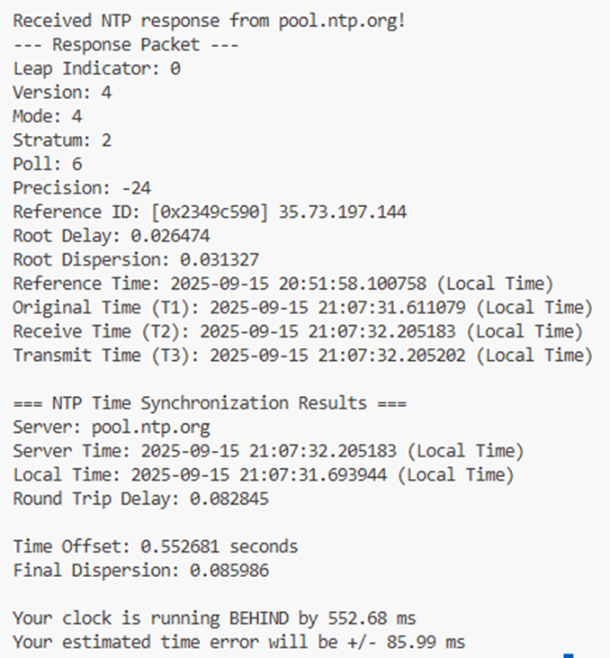
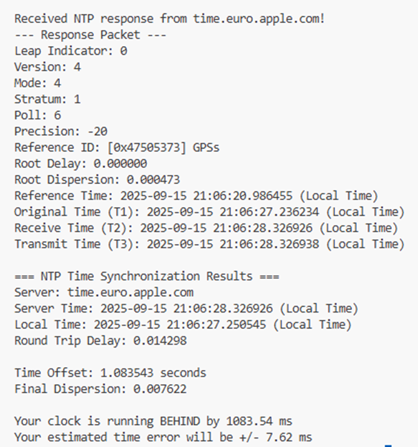

1. First, let’s discuss how our hardware system can go wrong. Our computer battery might have died and is unable to resync with the time server.  We may not be using cheap computers without oscillators, and the counting mechanism results in unsynchronized time. For a networking issue, the time server we would usually send requests to might be down. For software issues, the user of the computer might intentionally change the settings to stop getting time from the time servers. The software we are using might also stop our computer from sending requests to the time server.

2. Consider a distributed system that is running a lot of hardware (servers) in a single location. The reason the servers are all stacked together is to distribute the workload and make network latency small during the process. Similarly, distance is one of the most important factors in networking. Another example I can give is Netflix. Suppose you are watching a series on Netflix. You are probably streaming the series from a Netflix server that is around your region (not from another country unless all servers around you are down).   
From the pictures I attached, the first figure is from pool.ntp.org, and the second figure is from time.euro.apple.com. The first website is closer to us compared to the second website. We can look at total delay time and conclude that distance is a huge factor in network latency. With a higher delay, naturally, the offset will become higher as seen in the figures. Dispersion is harder to tell since it includes root delay and root dispersion.  
We might get a more accurate time sync from a “worse” time source that’s closer to us due to network latency. Another reason would be due to receiving a high stratum number from the better server. To sum up, we can see that distance and location matter when constructing a distributed system. Data should be available, and the location of the data matters in a distributed system.
 

 

3. If we use the simple approach, the algorithm would be a lot simpler. However, we will not be accounting for network delays, and so, the result we are getting is not accurate. Therefore, NTP needs to exchange multiple timestamps instead of just sending the current time to synchronize. This four-timestamp algorithm allows for an estimate of how out of sync relative to network time, including the network latency. We can also calculate the total delay to and from the host and client, and observe how big our latency and may even include this calculation for our confidence level.
